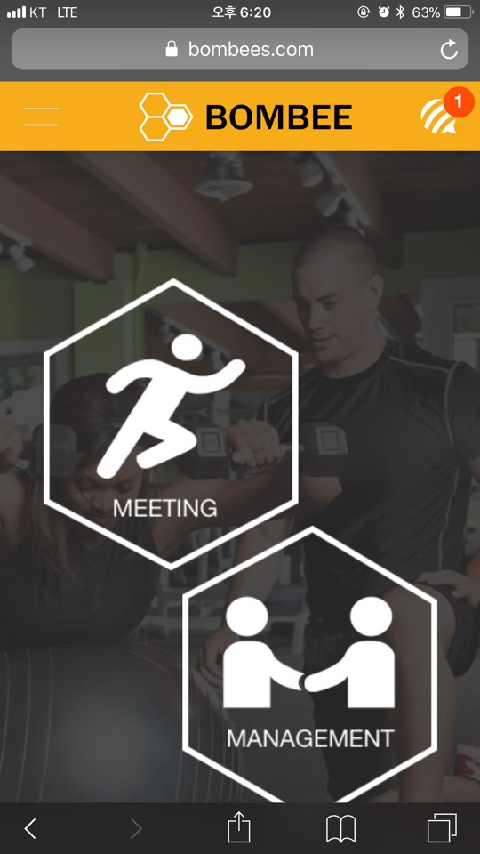
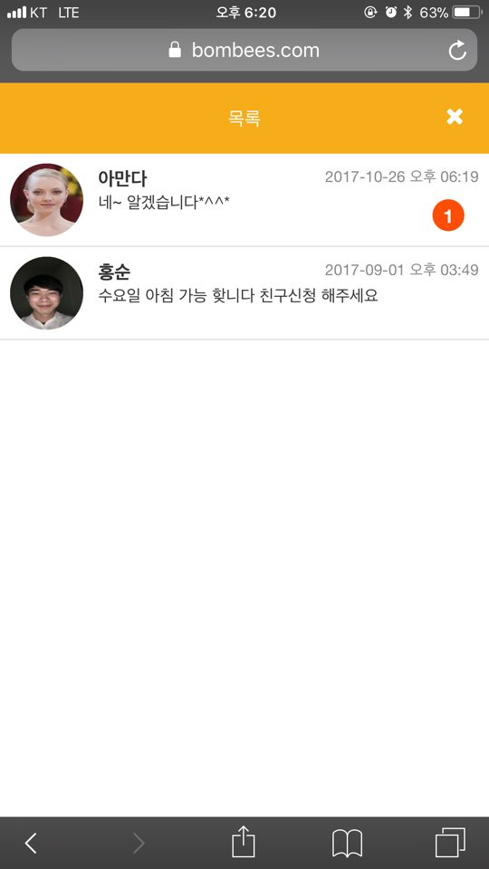
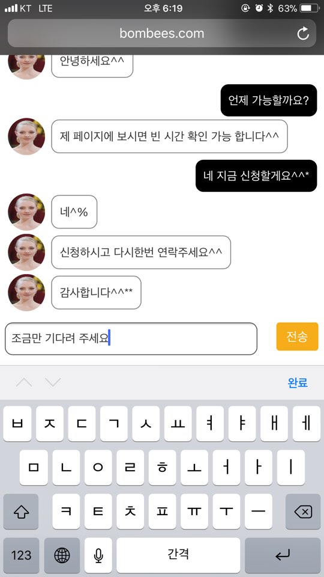
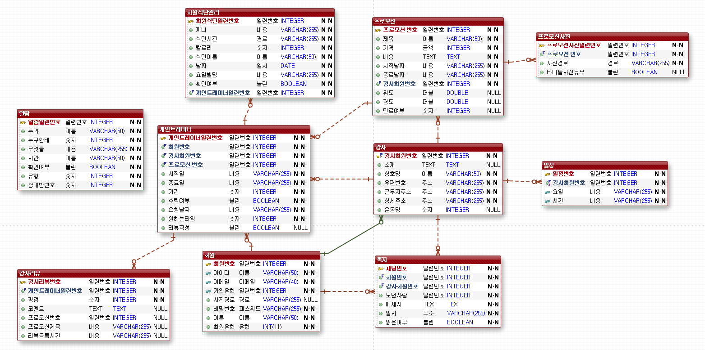

# BOMCHAT

**BOMBEE** 서비스(url: https://www.bombee.com) 에서 사용하는 채팅입니다.

- 사용할 수 있는 환경 : iPhone 6/7, 6+/7+

# 개발 기간

- 2017.07.01~2017.09.01

# 개발 동기

트레이닝 센터에 개인정보를 등록 후 트레이닝을 받게 되면, 트레이닝이 끝난 후에 광고성 문자나 전화가 오는 경우가 종종 있었습니다. 이러한 점을 방지하기 위하여 서비스 내에서 채팅을 통해 문의 사항 및 스케줄 조정을 할 수 있도록 만들었습니다.

# 개발 목적
```
- 트레이너에게 개인정보(핸드폰번호, SNS ID 등)를 사용하지 않고 실시간 채팅 기능으로 편리하게 연락할 수 있습니다.
```
# 개발 환경
 ```
- Back End : NodeJS
- DB : MySql
- Server : AWS(Amazon WebServer), NodeJS
- Front End : AJAX, jQuery
- Tool : Eclipse, Atom, eXERD
```
# 화면

- Chating

  

# 테이블 구조

- DB Table



| ALERT 테이블(알람)|||
| :-----: | :-: |:-: |
| ALNO **`(PK)`**	| 알람 번호	| INTEGER NOT NULL|
| OTHERNAME | 상대방 이름	| VARCHAR(255) NOT NULL|
| MYMNO | 요청한 사람 회원번호	| INTEGER	NOT NULL|
| KINDS | 알람 종류 | VARCHAR(255)	NOT NULL|
| DATE | 알람 발생 날짜 | VARCHAR(50)	NOT NULL|
| CONFIRM	| 확인 여부 	| BOOLEAN NOT NULL |
| TYPE | 알람 종류 분류	| INTEGER NOT NULL |
| OTHERMNO | 상대방 사용자 번호	| INTEGER NOT NULL |

| CHAT 테이블(채팅)|||
| :-----: | :-: |:-: |
| CNO **`(PK)`**| 채팅 번호	| INTEGER NOT NULL|
| MNO	**`(FK)`**| 멤버 번호	| INTEGER NOT NULL|
| TNO	**`(FK)`**| 강사 번호	| INTEGER NOT NULL|
| WHOSEND | 보낸 사람	| INTEGER	NOT NULL|
| MSG | 메세지	| TEXT	NOT NULL|
| CONFIRM | 확인 여부 | BOOLEAN NOT NULL|
